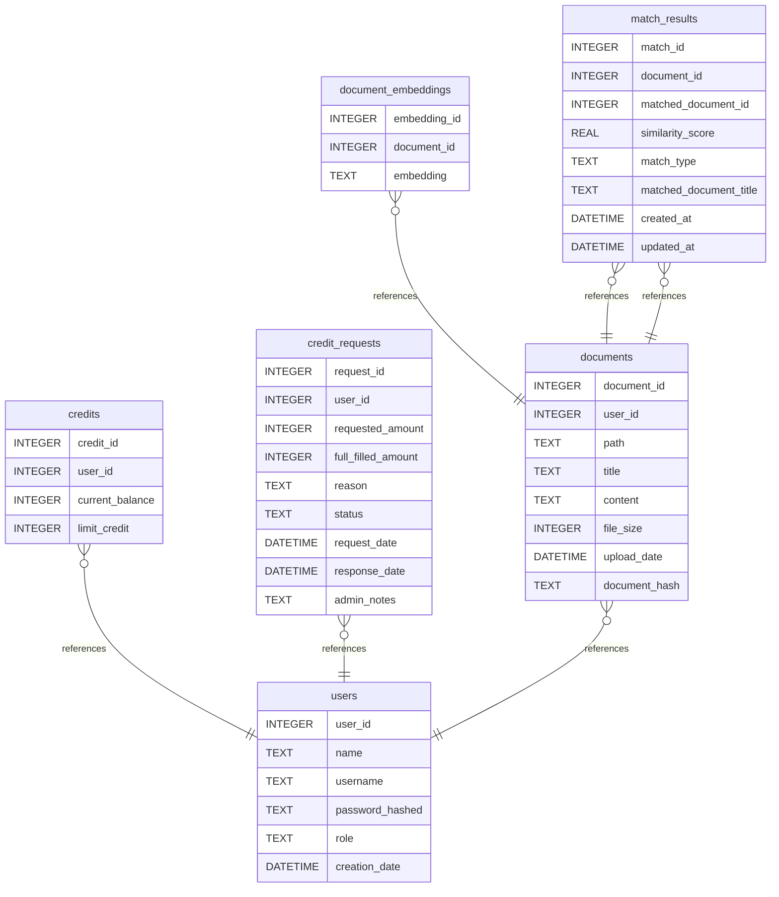
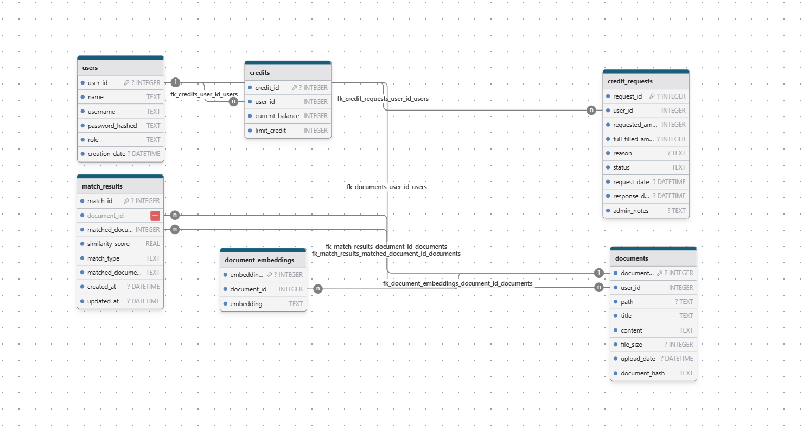

# DocVault DB Diagram documentation
## Summary

- [DocVault DB Diagram documentation](#docvault-db-diagram-documentation)
  - [Summary](#summary)
  - [Introduction](#introduction)
  - [Database type](#database-type)
  - [Table structure](#table-structure)
    - [users](#users)
    - [credits](#credits)
    - [credit\_requests](#credit_requests)
    - [documents](#documents)
    - [document\_embeddings](#document_embeddings)
    - [match\_results](#match_results)
  - [Relationships](#relationships)
  - [Database Diagram](#database-diagram)
    - [DB Diagram](#db-diagram)

## Introduction

## Database type

- **Database system:** SQLite
## Table structure

### users

| Name                | Type     | Settings                              | References | Note |
| ------------------- | -------- | ------------------------------------- | ---------- | ---- |
| **user_id**         | INTEGER  | 🔑 PK, not null , autoincrement        |            |      |
| **name**            | TEXT     | not null                              |            |      |
| **username**        | TEXT     | not null , unique                     |            |      |
| **password_hashed** | TEXT     | not null                              |            |      |
| **role**            | TEXT     | not null , default: user              |            |      |
| **creation_date**   | DATETIME | not null , default: CURRENT_TIMESTAMP |            |      |

### credits

| Name                | Type    | Settings                       | References               | Note |
| ------------------- | ------- | ------------------------------ | ------------------------ | ---- |
| **credit_id**       | INTEGER | 🔑 PK, not null , autoincrement |                          |      |
| **user_id**         | INTEGER | not null                       | fk_credits_user_id_users |      |
| **current_balance** | INTEGER | not null , default: 20         |                          |      |
| **limit_credit**    | INTEGER | not null , default: 20         |                          |      |

### credit_requests

| Name                   | Type     | Settings                              | References                       | Note |
| ---------------------- | -------- | ------------------------------------- | -------------------------------- | ---- |
| **request_id**         | INTEGER  | 🔑 PK, not null , autoincrement        |                                  |      |
| **user_id**            | INTEGER  | not null                              | fk_credit_requests_user_id_users |      |
| **requested_amount**   | INTEGER  | not null                              |                                  |      |
| **full_filled_amount** | INTEGER  | not null                              |                                  |      |
| **reason**             | TEXT     | not null                              |                                  |      |
| **status**             | TEXT     | not null , default: pending           |                                  |      |
| **request_date**       | DATETIME | not null , default: CURRENT_TIMESTAMP |                                  |      |
| **response_date**      | DATETIME | not null                              |                                  |      |
| **admin_notes**        | TEXT     | not null                              |                                  |      |

### documents

| Name              | Type     | Settings                              | References                 | Note |
| ----------------- | -------- | ------------------------------------- | -------------------------- | ---- |
| **document_id**   | INTEGER  | 🔑 PK, not null , autoincrement        |                            |      |
| **user_id**       | INTEGER  | not null                              | fk_documents_user_id_users |      |
| **path**          | TEXT     | not null                              |                            |      |
| **title**         | TEXT     | not null                              |                            |      |
| **content**       | TEXT     | not null                              |                            |      |
| **file_size**     | INTEGER  | not null                              |                            |      |
| **upload_date**   | DATETIME | not null , default: CURRENT_TIMESTAMP |                            |      |
| **document_hash** | TEXT     | not null                              |                            |      |

### document_embeddings

| Name             | Type    | Settings                       | References                                   | Note |
| ---------------- | ------- | ------------------------------ | -------------------------------------------- | ---- |
| **embedding_id** | INTEGER | 🔑 PK, not null , autoincrement |                                              |      |
| **document_id**  | INTEGER | not null                       | fk_document_embeddings_document_id_documents |      |
| **embedding**    | TEXT    | not null                       |                                              |      |

### match_results

| Name                       | Type     | Settings                              | References                                     | Note |
| -------------------------- | -------- | ------------------------------------- | ---------------------------------------------- | ---- |
| **match_id**               | INTEGER  | 🔑 PK, not null , autoincrement        |                                                |      |
| **document_id**            | INTEGER  | not null                              | fk_match_results_document_id_documents         |      |
| **matched_document_id**    | INTEGER  | not null                              | fk_match_results_matched_document_id_documents |      |
| **similarity_score**       | REAL     | not null                              |                                                |      |
| **match_type**             | TEXT     | not null                              |                                                |      |
| **matched_document_title** | TEXT     | not null                              |                                                |      |
| **created_at**             | DATETIME | not null , default: CURRENT_TIMESTAMP |                                                |      |
| **updated_at**             | DATETIME | not null , default: CURRENT_TIMESTAMP |                                                |      |

## Relationships

- **credits to users**: many_to_one
- **credit_requests to users**: many_to_one
- **documents to users**: many_to_one
- **document_embeddings to documents**: many_to_one
- **match_results to documents**: many_to_one
- **match_results to documents**: many_to_one

## Database Diagram

### DB Diagram
